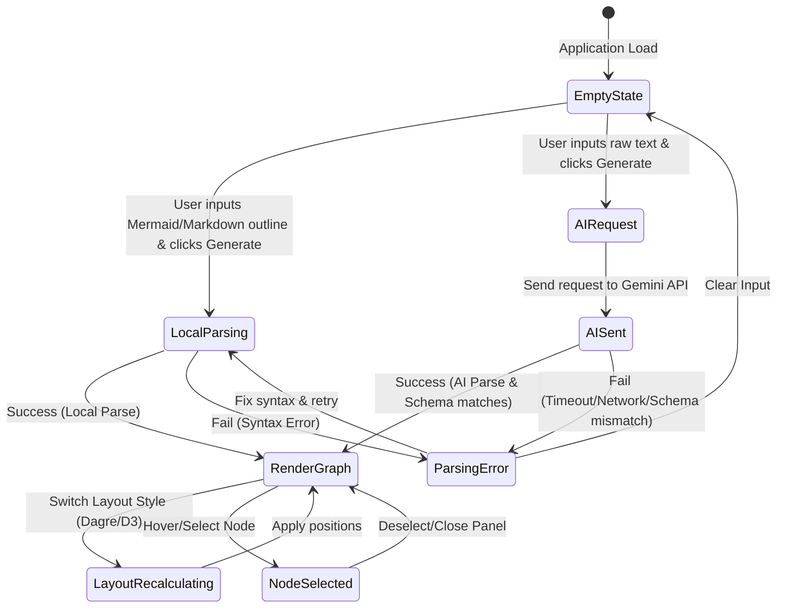

# Data Model: Generate Map

This document outlines the data schemas and state representation used for the map generation feature.

## 1. Graph State Entities

### Node Schema
Represents a single node on the canvas. It matches the structure required by React Flow with custom attributes inside the `data` field.

| Property | Type | Description | Validation / Constraints |
| --- | --- | --- | --- |
| `id` | String | Unique identifier | Must be non-empty and unique. Auto-generated as a string of words or hashes. |
| `type` | String | Custom React Flow node type | Defaults to `"customNode"`. |
| `position` | Object | Coordinates on the canvas | `{ x: Number, y: Number }`. Cannot be null. |
| `data` | Object | Custom visual metadata | Structure defined below. |

#### Node `data` Field Details:
* `label` (String, Required): Short name of the entity shown in the visual card. Must be <= 50 characters.
* `category` (Enum, Required): Type of the node for context styling. Allowed values: `["concept", "action", "warning", "question"]`.
* `description` (String, Optional): Elaborated details of the node shown in the side panel.

---

### Edge Schema
Represents a directed link connecting two nodes.

| Property | Type | Description | Validation / Constraints |
| --- | --- | --- | --- |
| `id` | String | Unique identifier | Format: `"e-[sourceId]-[targetId]"`. |
| `source` | String | Source node ID | Must match an existing Node `id`. |
| `target` | String | Target node ID | Must match an existing Node `id`. Cannot equal `source`. |
| `label` | String | Optional label text for relationship | Displayed on the connector line. |
| `type` | String | Line drawing algorithm | Defaults to `"smoothstep"`. |

---

## 2. Application UI State
The main React container handles the session state:

| State Key | Type | Initial Value | Description |
| --- | --- | --- | --- |
| `nodes` | Array<Node> | `[]` | Active nodes rendered on canvas. |
| `edges` | Array<Edge> | `[]` | Active connections between nodes. |
| `layout` | String | `"hierarchical-td"` | Layout style. Options: `"hierarchical-td"`, `"hierarchical-lr"`, `"mind-map"`. |
| `rawInput` | String | `""` | Source text from the input area. |
| `isLoading` | Boolean | `false` | True when awaiting Gemini API extraction. |
| `error` | Object \| Null | `null` | Contains `{ message, rawLog }` if parsing/generation fails. |
| `selectedNodeId` | String \| Null | `null` | ID of the node currently highlighted or displayed in the sidebar. |

## 3. State Transitions

