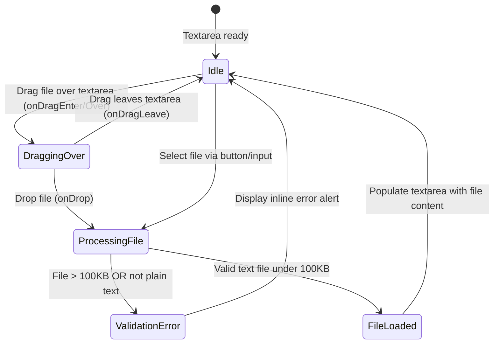

# Data Model: Drag/Upload Text

This document outlines the data schemas, validation constraints, and React UI states introduced for the Drag/Upload Text feature.

## 1. Uploaded File Entity

When a file is loaded via drag-and-drop or the file selection dialog, it is processed into an in-memory representation before populating the text input area.

### UploadedFile Schema

| Property | Type | Description | Validation / Constraints |
| --- | --- | --- | --- |
| `name` | String | Original filename | Used for logging and context (must not be empty). |
| `size` | Number | File size in bytes | Must be `<= 102400` bytes (100KB). If exceeded, reject with validation error. |
| `type` | String | File MIME type | Used as a primary text check (e.g., `text/plain`, `text/markdown`). |
| `content` | String | Decoded text contents | The UTF-8 decoded content of the file. Must be non-empty. |

---

## 2. Application State Extensions

The `ControlPanel` component and main `App` state will be extended to track the drag interaction and file selection:

| State Key | Component | Type | Initial Value | Description |
| --- | --- | --- | --- | --- |
| `isDragging` | `ControlPanel` | Boolean | `false` | Set to `true` when a file is dragged over the textarea boundaries; triggers the visual drop-zone overlay. |
| `error` | `App` | Object \| Null | `null` | Existing state. Will be populated with validation error messages if file size or type limits are violated. |

---

## 3. UI State Transitions

The state machine for dragging and dropping / uploading a file is shown below:

