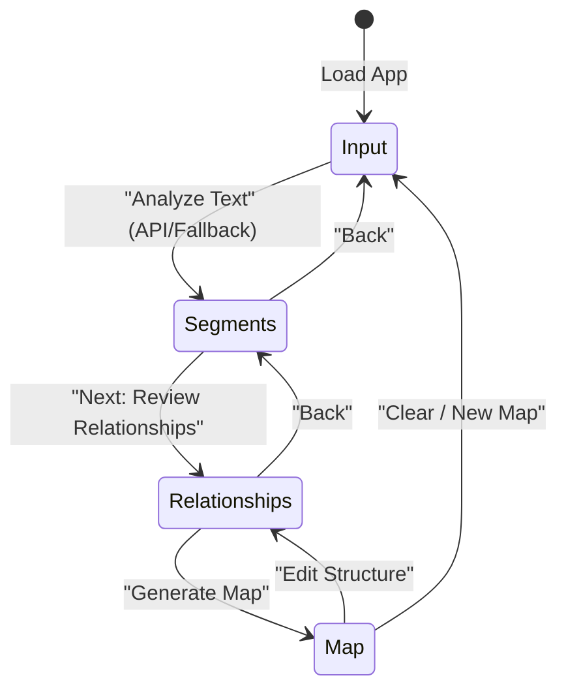

# Data Model: Clean and Segment Text

This document defines the key entities, validation rules, and states used during the text cleaning, segmentation, and mapping process.

## 1. Core Entities

### Segment (Node Candidate)
Represents a clean, semantic block of text extracted from the raw input.

| Field | Type | Description | Validation |
| --- | --- | --- | --- |
| `id` | String | Unique identifier (kebab-case) | Must be unique, non-empty |
| `title` | String | Short title of the segment | Max 50 characters, non-empty |
| `content` | String | Main text content or summary | Non-empty |
| `category` | Enum | Classification of the segment | Must be one of: `concept`, `action`, `warning`, `question` |

### Relationship (Edge Candidate)
Represents a connection or relation between two segments.

| Field | Type | Description | Validation |
| --- | --- | --- | --- |
| `id` | String | Unique identifier | Must be unique |
| `sourceSegmentId` | String | ID of the source segment | Must exist in the Segments array |
| `targetSegmentId` | String | ID of the target segment | Must exist in the Segments array |
| `label` | String | Label describing the relationship | Max 40 characters, non-empty |

---

## 2. Wizard State Model

The entire state is maintained in-memory within the root component (`App.jsx`):

```typescript
interface WizardState {
  step: 'input' | 'segments' | 'relationships' | 'map';
  rawInput: string;
  segments: Segment[];
  relationships: Relationship[];
}
```

### State Transitions



### State Validation Rules
- **No Orphan Edges**: When a segment is deleted, any relationship (edge) referencing its `id` as `sourceSegmentId` or `targetSegmentId` MUST be automatically removed.
- **Unique IDs**: When a new segment is manually added, a unique kebab-case ID must be auto-generated (e.g. `seg-manual-timestamp`).
- **No Self-Loops**: A relationship cannot have the same `sourceSegmentId` and `targetSegmentId`.
